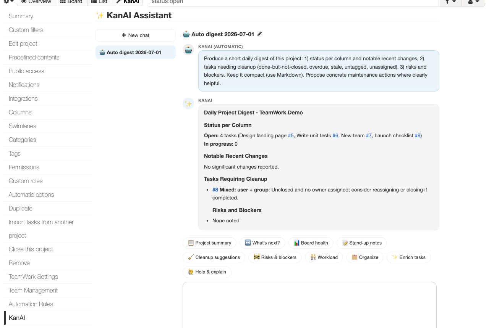
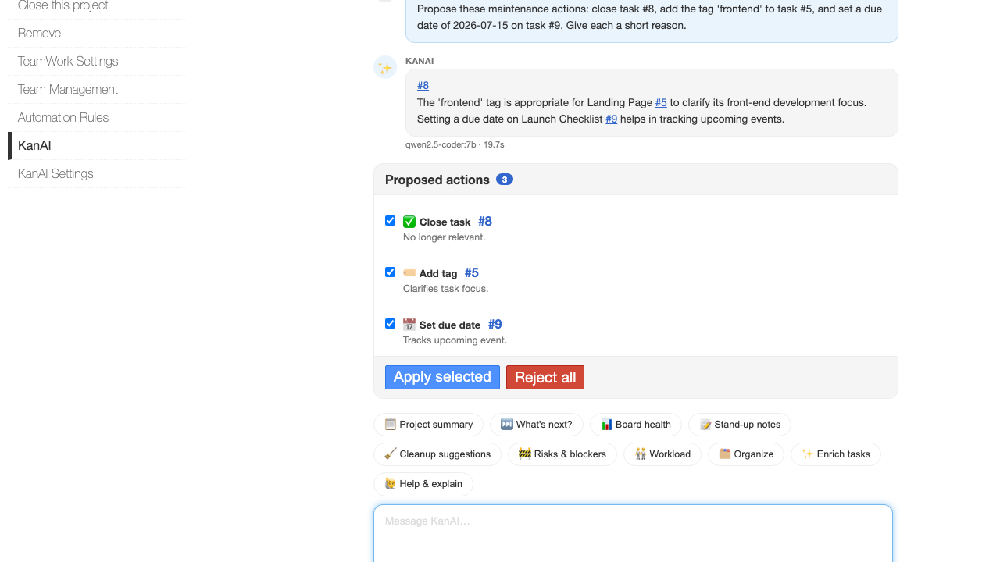
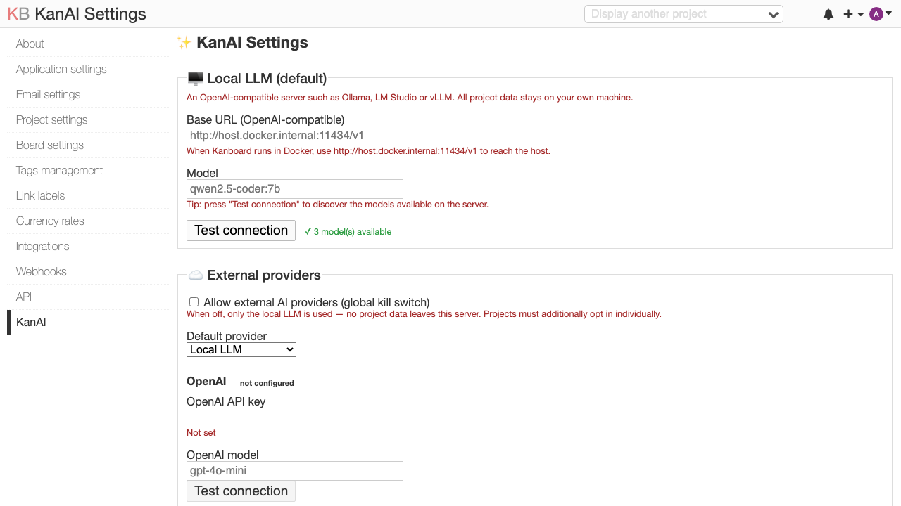
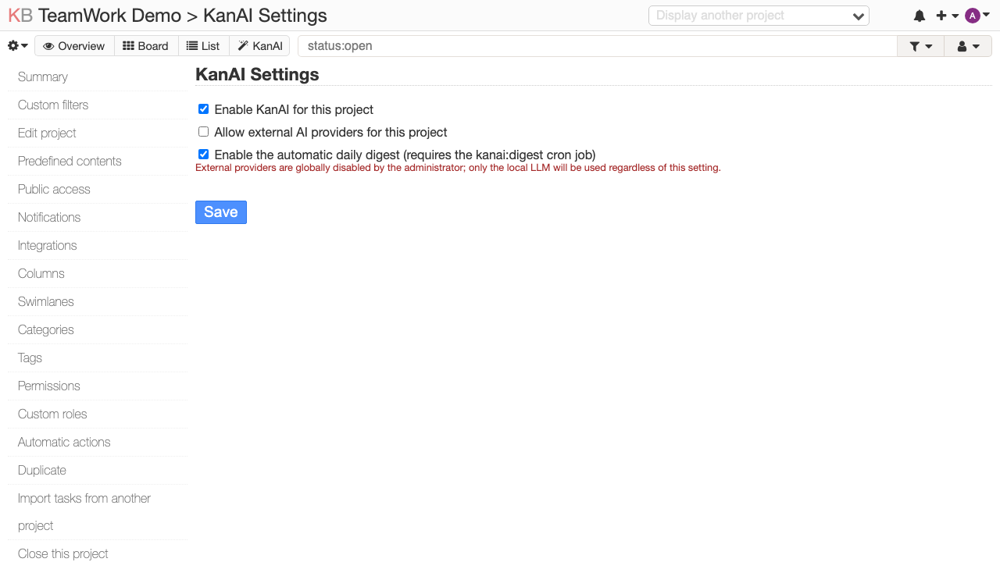

# KanAI — AI assistant & project Q&A for Kanboard

KanAI connects a Kanboard instance to an LLM. It works **fully on a local LLM**
(Ollama / LM Studio / vLLM / any OpenAI-compatible server) and can **optionally**
use external providers (Anthropic Claude, OpenAI). An administrator can switch
all external AI off with a single, server-enforced kill switch — by default no
project data ever leaves your server.

## Features

### 💬 Shared chat per project
A **KanAI tab** next to Overview / Board / List opens a chat panel with multiple
conversations (create, rename, delete). Conversations are shared with every
project member, so a colleague can pick up where you left off; each message
shows the sender's avatar and name. Messages send without a page reload
(Enter to send, Shift+Enter for a new line), answers render as Markdown, task
references like `#9` become clickable links, and each answer shows which model
produced it and how long it took.

### 🤖 Assistant with human approval
Ask KanAI to tidy the board and it **proposes** maintenance actions — it never
applies anything on its own. You review the proposals, tick the ones you want,
and they are applied through Kanboard's own models as *your* user, so
permissions, validations and activity streams all work normally.

Whitelisted actions (anything else the model suggests is rejected):

| Action | | Action | |
|---|---|---|---|
| `create_task` | ➕ create a task | `assign_task` | 👤 set the owner |
| `update_task` | ✏️ improve title/description | `add_tag` | 🏷️ add tags |
| `close_task` | ✅ close | `set_due_date` | 📅 set a due date |
| `reopen_task` | ↩️ reopen | `add_comment` | 💬 add a comment |
| `move_task` | ➡️ move to a column | `add_subtask` | ☑️ add a subtask |
| `link_tasks` | 🔗 relate two tasks | | |

### ⚡ Quick actions
One-click presets above the composer:

📋 Project summary · ⏭️ What's next? · 📊 Board health · 📝 Stand-up notes ·
🧹 Cleanup suggestions · 🚧 Risks & blockers · 🧑‍🤝‍🧑 Workload · 🗂️ Organize ·
✨ Enrich tasks · 🙋 Help & explain

### 🕖 Automatic daily digest (optional)
Projects can opt in to an autonomous digest: KanAI starts a fresh conversation
with a compact status / cleanup / risks report and proposals for members to
review (rendered as "KanAI (automatic)" 🤖). Schedule it from cron:

    0 7 * * * php /path/to/kanboard/cli kanai:digest >/dev/null 2>&1

For Docker: `docker exec <container> php /var/www/app/cli kanai:digest`.

### 🔒 Security model
- **Local-first**: the default provider is your own OpenAI-compatible server;
  external providers are OFF until an admin enables them *and* each project
  opts in — enforced server-side, not in the UI.
- **Human approval gate**: no model output ever changes project state without
  an explicit click; project content is treated as untrusted input
  (prompt-injection framing in the system prompt).
- **API keys encrypted at rest** (AES-256-GCM), masked in the UI, never sent
  to the browser.
- **Rate limiting**: questions per user per hour are capped (configurable),
  refused before any LLM call.
- CSRF-validated actions, per-project access control (members chat, managers
  configure, admins manage providers).

## Install

Copy or symlink this repository into your Kanboard `plugins/` directory as
`KanAI`:

    ln -s /absolute/path/to/KanAI <kanboard>/plugins/KanAI

For Docker, bind-mount the folder to `/var/www/app/plugins/KanAI`. Then open
**Settings → Plugins** to confirm KanAI is listed. The database migrations run
automatically.

**Requirements:** Kanboard ≥ 1.2.46, PHP ≥ 7.4 with cURL and OpenSSL, and an
LLM endpoint (e.g. [Ollama](https://ollama.com) with a ~7B model such as
`qwen2.5-coder:7b` — answers in seconds; larger models give richer answers).

## Configure

### Global (Settings → KanAI, admins)

Set the local endpoint and model, manage external providers, and tune limits.
The **Test connection** button verifies the endpoint live and — for the local
server — discovers the available models as suggestions for the model field.

| Setting | Default | |
|---|---|---|
| Base URL | `http://localhost:11434/v1` | any OpenAI-compatible server; use `http://host.docker.internal:11434/v1` from Docker |
| External providers | off | global kill switch for OpenAI/Anthropic |
| Max context tokens | 8000 | how much project data goes into a question |
| Max output tokens | 1024 | answer length budget |
| Request timeout | 120s | local models can take a while |
| Rate limit | 30/user/hour | 0 = unlimited |
| History retention | forever | auto-purge idle conversations after N days |

### Per project (project sidebar → KanAI Settings, managers)

KanAI is off per project until enabled here. External providers additionally
require the per-project opt-in, and the automatic daily digest is a separate
opt-in.

### Production note: encryption key

KanAI encrypts external-provider API keys at rest. For production, set a stable
secret in your Kanboard `config.php`:

    define('KANAI_SECRET', 'a-long-random-string');

If unset, KanAI generates a per-install key and stores it in the database
(weaker, but keys are never stored in plaintext).

## How it works

Questions are answered with retrieval-augmented context: KanAI selects the
project's most relevant tasks, comments and subtasks (keyword + recency
scoring, capped by the token budget), wraps them in a clearly-delimited
data block, and asks the model for a strict JSON envelope
(`{"answer": …, "proposals": […]}`). Proposals are validated against the action
whitelist, stored, and only applied after human approval. The session lock is
released during the LLM call so Kanboard stays responsive while the model
thinks.

## Development

Pure-logic classes (crypto, gating policy, LLM request/response shaping,
proposal validation, RAG helpers) are unit-tested standalone:

    php composer.phar install
    ./vendor/bin/phpunit

Design docs and build plans live in `docs/superpowers/`. Translations:
English (source) and Dutch (`Locale/nl_NL`).

## License

MIT — see [LICENSE](LICENSE).
